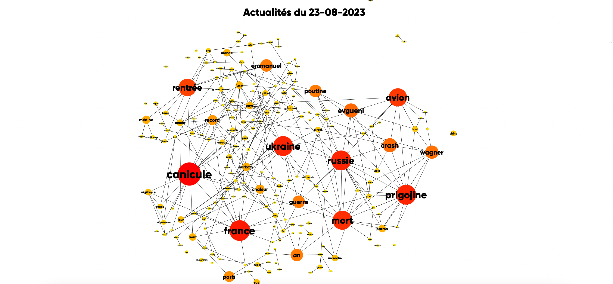

# RSS Trends Analysis

## Introduction

This repository contains code and resources related to the article "RSS Trends: Finding Topics in French News using RSS Feeds" published on [my blog](https://antoninfaure.ch/post/rsstrend/). The article explores the process of analyzing RSS feeds from major French media outlets to create a Text Network depicting news trends and connections between the most frequent terms.

## Contributing

Contributions are welcome! If you find any issues or want to improve the analysis, feel free to open a pull request.

## License

This project is licensed under the [MIT License](LICENSE).

---

For more details, please refer to the full article on [my blog](https://antoninfaure.ch/post/rsstrend/).
